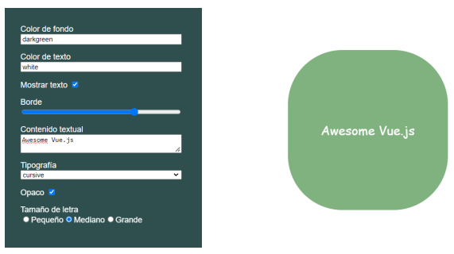

- [Templates y rendering en Vue](#templates-y-rendering-en-vue)
  - [Requerimientos](#requerimientos)
  - [Pasos](#pasos)
  - [Resultado](#resultado)

# Templates y rendering en Vue

- Descripción

En este desafío tendremos que crear una aplicación Vue Js desde 0 y maquetar la siguiente interfaz. En donde los inputs del formulario deberán modificar los estilos de la figura de la derecha.




  ---

## Requerimientos

1.  Usar el style binding para asignar estilos reactivamente a un elemento usando valores del estado.

2. Usar el class binding para asignar clases reactivamente a un elemento usando valores booleanos del estado.


3. Usar v-for para iterar un arreglo del estado en el template para la renderización dinámica de elementos.


4. Usar v-show para mostrar u ocultar la figura.

   

   ---


## Pasos

1. Se Crea la carpeta mediante la terminal con el siguiente comando "vue create --default mi-ejemplo"


2.  Agregamos los div respectivos en el template de App.vue y estructuramos los estilos.


3. Procedemos a Usar el style binding para asignar estilos reactivamente el cual define los estilos que se aplicarán dinámicamente al elemento div con la clase square.

   
   
   

4. Hacemos lo mismo para el class binding para asignar las clases. Este código aplica dinámicamente diferentes clases al elemento span basado en los valores de las variables textStyles, textStyle y fontSizesRadio.

   

5. Usar v-for para iterar un arreglo del estado en el template para la renderización dinámica de elementos. El v-for Indica que se va a iterar sobre un conjunto de datos. en este caso (style, key).
   
   

 
6. Usamos v-show para mostrar u ocultar la figura, Si showSpan es true, el elemento se mostrará. Si showSpan es false, el elemento se ocultará.


 
---

## Resultado


```

